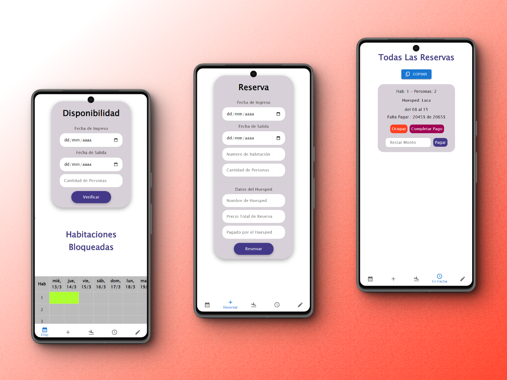
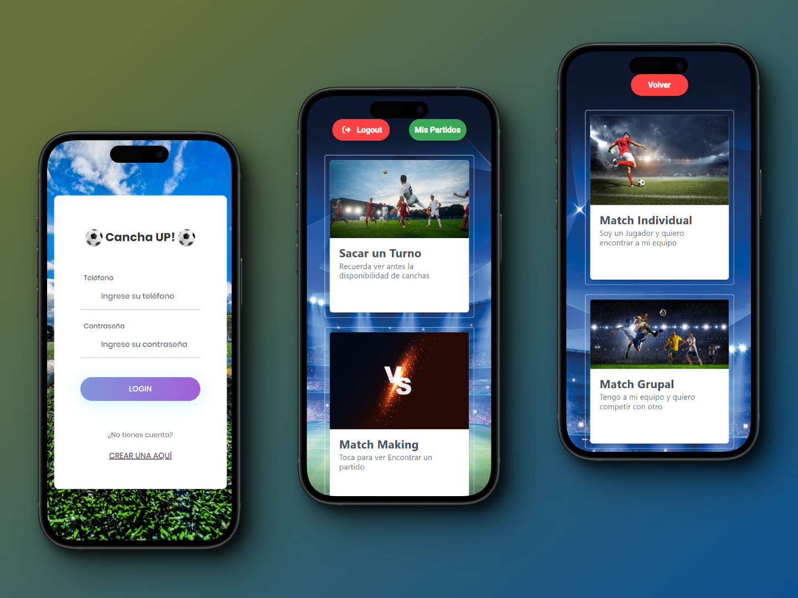

  

###

<h1 align="left">Bienvenido a mi perfil de GitHub!👋</h1>

###

Sobre Mi

###

Analista en Sistemas con experiencia tanto en el Backend como en el Frontend.   Técnico Electrónico con habilidades para resolver problemas técnicos complejos.

###

<h2 >Tecnologías 👨🏻‍💻</h2>

###

  

<h2 >Proyectos Destacados</h2>

<table align="left" >
<tr border="none">
<td width="50%" align="center">
  
  
Sistema de Reservas para un Hotel

  

    Diseñé una aplicación con Spring Boot y React para gestionar las reservas de un hotel y poder crearlas sin que colisionen. Esta aplicación proporciona una interfaz intuitiva para que el personal del hotel pueda realizar y administrar      reservas de habitaciones de manera eficiente.
  

</td>

<td width="50%" align="center">
  
  
CanchaUp - Sistema de Reserva de Canchas y Organización de Partidos de Fútbol

  

    CanchaUp es una aplicación web desarrollada con tecnologías modernas para facilitar la reserva de canchas y la organización de partidos de fútbol de manera eficiente y sencilla.
  

</td>

 
<tr border="none">
  <td width="50%" align="center">
      

   
Detección de Estacionamiento con YOLO

Desarrollé una aplicación de detección de estacionamiento utilizando el modelo YOLO (You Only Look Once) en Python. Esta aplicación utiliza inteligencia artificial para identificar vehículos en un video y determinar si están estacionados en lugares designados.
</td>

</tr>
</table>

<h3 align="center">¡No dudes en explorar mis repositorios para conocer más sobre mi trabajo!</h3>

<h2 > Contactame</h2>
Si tienes alguna pregunta o simplemente quieres charlar, no dudes en contactarme.
Puedes contactarme por correo electrónico a [lucamartinrivera@gmail.com](mailto:lucamartinrivera@gmail.com) o visitar mi perfil en [LinkedIn](https://www.linkedin.com/in/luca-rivera-721a7b294/).

¡Gracias por visitar mi perfil!
