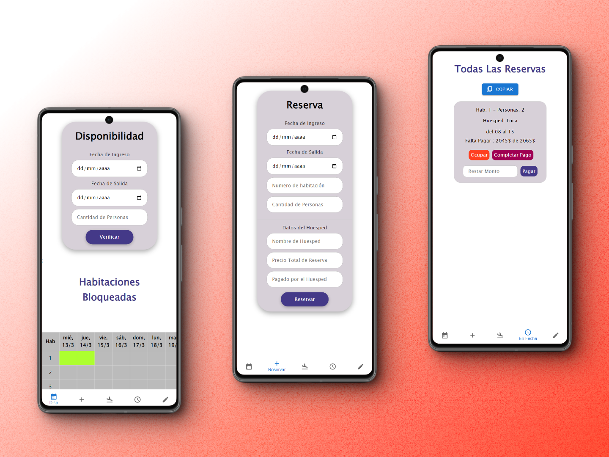
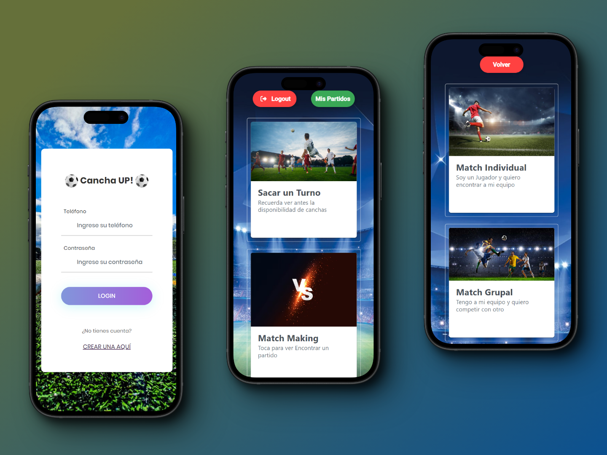
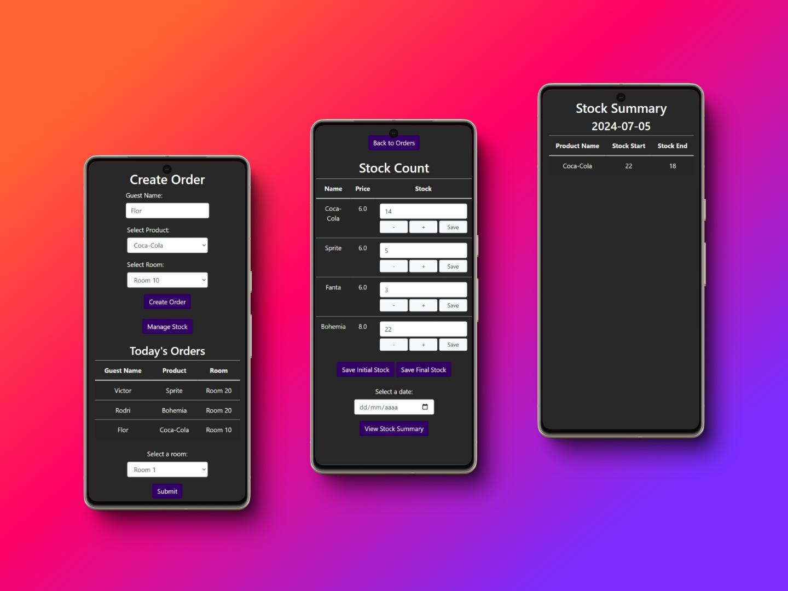

  

 

<h1 align="left">Luca Martin Rivera 👋</h1>

  <strong>Analista en Sistemas · Técnico Electrónico</strong> 
  Neuquén, Argentina

  Trabajo en el ciclo completo: desde el análisis de requerimientos hasta el deploy y mantenimiento, tanto en frontend como en backend.  
  Desarrollé sistemas reales en producción: dashboards ERP integrados con Tango, plataformas de reservas, sitios para empresas y un detector de estacionamiento con visión artificial.  
  Me gusta resolver problemas concretos. Si hay un problema de negocio, encuentro la solución técnica.

  
  
  

---

<h2>🛠️ Tecnologías</h2>

  

---

<h2>🚀 Proyectos Destacados</h2>

<table>
  <tr>
    <td width="50%" align="center">
      
        
      <strong>TangoDash — Dashboard ERP</strong>
      

        Dashboard full-stack para empresa distribuidora integrado con <strong>Tango ERP</strong>. Centraliza stock, proveedores, flujo de caja y órdenes de compra en tiempo real.  
        Módulos: ranking ABC de proveedores, calendario de vencimientos de cheques, análisis de CMV y generación de PDF descargable.  
        <code>Next.js 14</code> <code>TypeScript</code> <code>Python</code> <code>FastAPI</code> <code>SQL Server</code>
      

    </td>
    <td width="50%" align="center">
      
        
      <strong>CanchaUp — Reservas y Partidos</strong>
      

        Backend REST para reservas de canchas de fútbol y organización de partidos. Autenticación de usuarios, gestión de equipos y búsqueda de partidos.  
        Arquitectura Domain-Driven Design con Repository Pattern y separación clara de capas.  
        <code>Java</code> <code>Apache Causeway</code> <code>PostgreSQL</code>
      

    </td>
  </tr>
  <tr>
    <td width="50%" align="center">
      
        
      <strong>Detector de Estacionamiento con YOLO</strong>
      

        Sistema con modelo YOLO pre-entrenado que analiza video en tiempo real, cruza los bounding boxes detectados con coordenadas de espacios predefinidas y muestra un contador de ocupación dinámico.  
        <code>Python</code> <code>YOLO</code> <code>OpenCV</code> <code>TensorFlow</code>
      

    </td>
    <td width="50%" align="center">
      
        
      <strong>MeetingBar — Gestión de Bar Hotelero</strong>
      

        Sistema para bar en entorno hotelero: recuento de stock, creación de órdenes, comparación de inventario entre almacenes y búsqueda de pedidos por habitación y huésped.  
        <code>Spring Boot</code> <code>React</code> <code>MySQL</code>
      

    </td>
  </tr>
</table>

---

<h2>📊 GitHub Stats</h2>

  
  &nbsp;
  

---

  <em>¿Tenés un proyecto en mente? <a href="mailto:lucamartinrivera@gmail.com">Hablemos.</a></em>

